# API Endpoints

RESTful API built with .NET Minimal APIs.

**Base URL**: `https://localhost:{port}` (check `Properties/launchSettings.json`)  
**API Docs**: `/scalar/v1` (development mode)

## Endpoint Reference

```mermaid
graph LR
    subgraph "👥 /borrowers"
        BH[GET /health]
    end
    
    subgraph "🤝 /partners" 
        PH[GET /health]
    end
    
    subgraph "💰 /loans"
        LH[GET /health]
        LA[GET /]
        LI["GET /{id}"]
    end
```

### Health Endpoints
All modules provide health monitoring:
- `GET /borrowers/health` → "Borrowers API is healthy"
- `GET /partners/health` → "Partners API is healthy" 
- `GET /loans/health` → "Loans API is healthy"

### Loans Operations
- `GET /loans` → Array of all loans
- `GET /loans/{id}` → Specific loan (200) or 404

## Data Models

**Borrower**: `Id`, `Surname`, `GivenName`, `DateOfBirth`, `IdentificationNumber`, `PhoneNumber`, `Email`, `Address`, `PartnerId`

**Partner**: `Id`, `Name`, `Address`

**Loan**: `Id`, `LoanAmount`, `IssueDate`, `InterestRate{Rate,Period}`, `Duration{Length,Period}`, `LoanApplicationId`, `CreatedOn`

**Address**: `Town`, `District`, `Region`, `Country`

## Notes

**Period Enum**: `Annual(0)`, `Monthly(1)`, `Weekly(2)`, `Daily(3)`

**Authentication**: ⚠️ None (demo project)  
**Error Codes**: Standard HTTP (200, 404, 500)  
**Migrations**: Auto-applied at startup