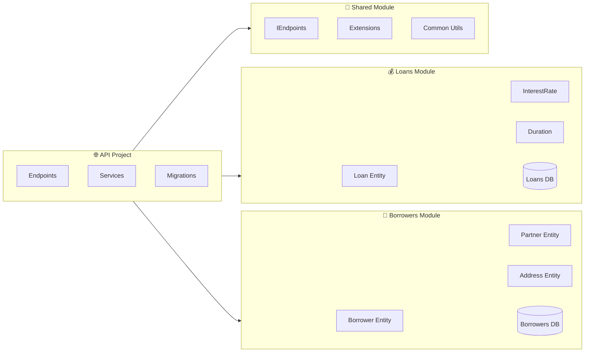
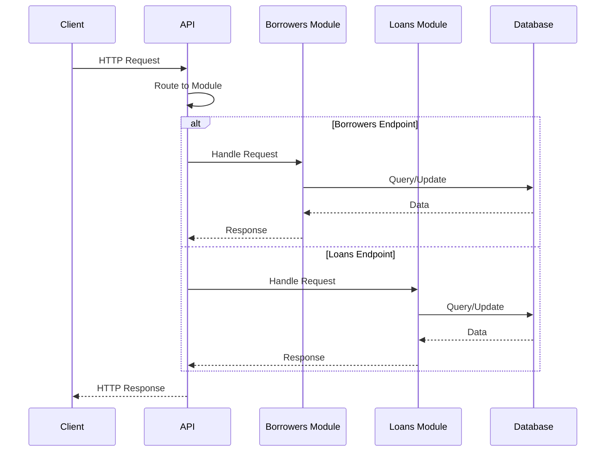

# Application Architecture

## Modular Monolith Pattern

Single deployable application organized into business domain modules:
- **Single Deployment**: One unit, simplified operations
- **Modular Organization**: Domain-based modules with clear boundaries  
- **Shared Infrastructure**: Common database access, logging, configuration

Provides better organization than traditional monoliths while avoiding microservices complexity.

## System Modules

### Borrowers Module
- **Entities**: `Borrower`, `Partner`, `Address`
- **Purpose**: Borrower and partner management

### Loans Module  
- **Entities**: `Loan` with `InterestRate`, `Duration`
- **Purpose**: Loan operations and tracking

### Shared Module
- **Components**: `IEndpoints`, common extensions
- **Purpose**: Cross-cutting infrastructure utilities

## API Integration Flow

Each module registers via extension methods:
- `AddBorrowersModule(configuration)`
- `AddLoansModule(configuration)` 
- Auto-migration at startup