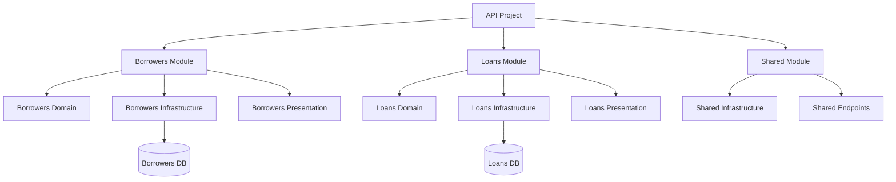

# Module Structure

Each module follows a consistent Domain-Driven Design (DDD) pattern with three layers:

```
ModuleName/
├── Domain/              # Business entities
├── Infrastructure/      
│   └── Data/           # EF DbContext, configurations, migrations
└── Presentation/       # API endpoints
```

## Layer Responsibilities

### Domain
Pure business entities and logic. No external dependencies.

### Infrastructure/Data  
- **DbContext**: Database operations
- **EntityConfigurations/**: EF mappings and relationships  
- **Migrations/**: Database schema versions

### Presentation
HTTP endpoints implementing `IEndpoints` interface.

## Working with Database Migrations

Each module manages its own database context and migrations.

### Creating Migrations

**For Borrowers module:**
```bash
# From solution root
dotnet ef migrations add InitialCreate \
  --project src/modules/Emata.Exercise.LoansManagement.Borrowers \
  --context BorrowersDbContext
```

**For Loans module:**
```bash
# From solution root  
dotnet ef migrations add InitialCreate \
  --project src/modules/Emata.Exercise.LoansManagement.Loans \
  --context LoansDbContext
```

### Running Migrations

**Automatic (recommended):**
Migrations run automatically at application startup via:
```csharp
// In Program.cs
await app.MigrateBorrowersDatabaseAsync();
await app.MigrateLoansDatabaseAsync();
```

**Manual execution:**
```bash
# Borrowers module
dotnet ef database update \
  --project src/modules/Emata.Exercise.LoansManagement.Borrowers \
  --context BorrowersDbContext

# Loans module  
dotnet ef database update \
  --project src/modules/Emata.Exercise.LoansManagement.Loans \
  --context LoansDbContext
```

## Module Architecture Diagram

